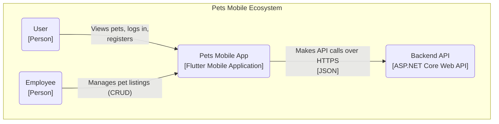
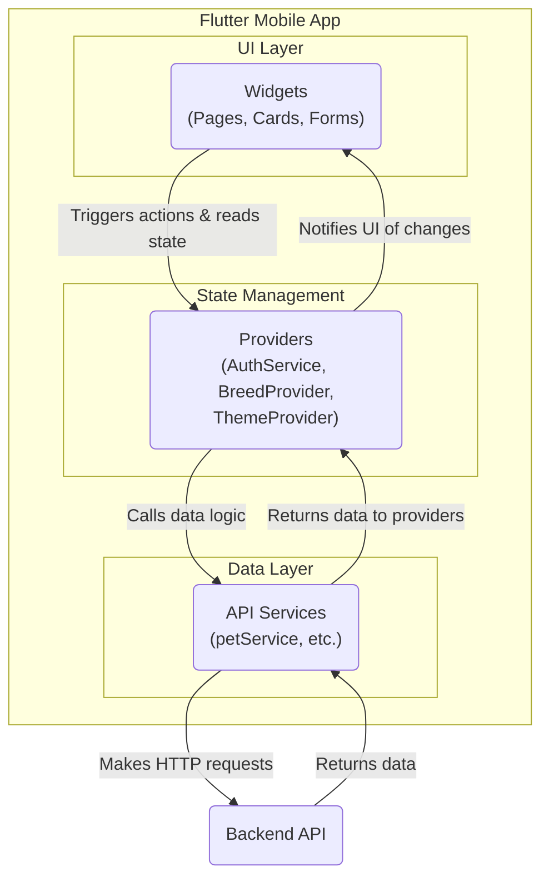

# Pets Mobile - Pet Adoption App

This repository contains the source code for a cross-platform mobile application for pet adoption, built with Flutter, and its corresponding backend API built with ASP.NET Core.

## Features

-   **Browse Pets:** View a list of available pets for adoption.
-   **User Authentication:** Secure login, registration, and session management using JWT and refresh tokens.
-   **Role-Based Access Control:** Certain actions (adding, editing, deleting pets) are restricted to users with an "Employee" role.
-   **CRUD Operations:** Authenticated employees can create, update, and delete pet listings.
-   **Image Uploads:** Users can pick a photo from their device's gallery, which is uploaded to the server.
-   **Dynamic Theming:** Supports both Light and Dark mode, respecting the user's system preference by default.
-   **State Management:** Uses the Provider package for efficient and centralized state management.

## Technology Stack

### Frontend (Flutter)
-   **Framework:** Flutter 3+
-   **Language:** Dart
-   **State Management:** `provider`
-   **HTTP Client:** `http`
-   **Secure Storage:** `flutter_secure_storage`
-   **Token Handling:** `jwt_decoder`
-   **Image Handling:** `image_picker`

### Backend (ASP.NET Core)
-   **Framework:** .NET 8 (or compatible)
-   **Language:** C#
-   **API:** RESTful API with ASP.NET Core Web API
-   **Authentication:** JWT Bearer Tokens
-   **Database:** Entity Framework Core (compatible with SQL Server, PostgreSQL, etc.)

## System Architecture (C4 Model)

The architecture is documented using the C4 model to provide different levels of detail about the system's structure.

### Level 1: System Context Diagram

This diagram shows the system in its environment with users and external systems.



### Level 2: Container Diagram

This diagram zooms into the backend to show its major building blocks or "containers".


### Level 3: Component Diagram (Flutter App)

This diagram breaks down the Flutter application into its key components and their responsibilities.



## UI Wireframes

This section describes the layout and key elements of each screen in the application.

### 1. Home Page
-   **Layout:** A standard `Scaffold` with an `AppBar` and a body.
-   **AppBar:** Contains the application title ("Pets Mobile") and a hamburger icon to open the `AppDrawer`.
-   **Body:** A `ListView` that displays a vertically scrollable list of `PetCard` widgets. The entire list is wrapped in a `RefreshIndicator` for pull-to-refresh functionality.
-   **Floating Action Button:** An extended FAB with an "Add Pet" label and icon is visible in the bottom-right corner **only if** the logged-in user has the "Employee" role.

### 2. Pet Details Modal
-   **Layout:** A modal bottom sheet that slides up from the bottom.
-   **Header:** A large image of the pet occupies the top portion.
-   **Content:** Below the image, there is a padded column containing:
    -   Pet's Name (Large, bold text).
    -   Breed Name (Slightly smaller, secondary text).
    -   Info Chips (e.g., "5 years old", "Golden") arranged horizontally.
    -   A divider.
    -   "About" and "Breed Details" sections with descriptive text.
-   **Action Buttons (Conditional):** If the user is an "Employee", a row of two buttons ("Edit" and "Remove") appears at the bottom.

### 3. Add/Edit Pet Page
-   **Layout:** A full-screen `Scaffold` with a back arrow in the `AppBar`.
-   **AppBar:** Title is "Add a New Pet" or "Edit [Pet Name]".
-   **Body:** A scrollable `Form` containing:
    -   An image container at the top that shows the selected image or a placeholder. Tapping it opens the device's image gallery.
    -   Text fields for Name, Color, and Age.
    -   A multi-line text field for Description.
    -   A `DropdownButtonFormField` to select the pet's Breed from a list fetched from the API.
    -   A large submit button ("Add Pet" or "Save Changes") at the bottom.

### 4. Login / Register Pages
-   **Layout:** A simple full-screen `Scaffold` with a back arrow.
-   **AppBar:** Title is "Login" or "Register".
-   **Body:** A `Form` with text fields for user details (Name, Surname, Age, Email, Password, Confirm Password).
-   **Action:** A single "Login" or "Register" button to submit the form.

### 5. App Drawer (Menu)
-   **Layout:** A standard `Drawer` that slides out from the left.
-   **Header:** An `AppBar` with the title "Menu".
-   **Content (Logged Out):** List tiles for "Login" and "Register".
-   **Content (Logged In):** A single list tile for "Logout".
-   **Footer:** A `SwitchListTile` with the label "Dark Mode" and a toggle switch to control the application's theme.

---

## Setup & Running the Application

Follow these steps to get both the backend and frontend running locally.

### 1. Backend Setup

1.  **Clone the Repository:**
    ```bash
    git clone <your-repository-url>
    cd <repository-folder>/PetsMobile
    ```

2.  **Create `wwwroot` Folder:**
    At the root of the ASP.NET Core project, create an empty folder named `wwwroot`. This is required for storing uploaded images.

3.  **Configure `appsettings.json`:**
    Open `appsettings.json` and configure your database connection string and JWT settings.

    ```json
    {
      "ConnectionStrings": {
        "DefaultConnection": "Server=YOUR_SERVER;Database=PetsMobileDb;Trusted_Connection=True;TrustServerCertificate=True;"
      },
      "Jwt": {
        "Key": "YOUR_SUPER_SECRET_AND_LONG_JWT_KEY_HERE",
        "Issuer": "https://localhost:7123", 
        "Audience": "https://localhost:7123"
      }
    }
    ```

4.  **Apply Database Migrations:**
    Open a terminal in the backend project directory and run the following command.
    ```bash
    dotnet ef database update
    ```

5.  **Run the Backend:**
    Run the project from Visual Studio (F5) or via the command line:
    ```bash
    dotnet run
    ```
    Note the URL the application is running on (e.g., `http://localhost:5215`).

### 2. Frontend Setup

1.  **Navigate to the Frontend Directory:**
    Open a new terminal and navigate to the Flutter project folder.
    ```bash
    cd <repository-folder>/pets_mobile_flutter_app
    ```

2.  **Configure the API URL:**
    Open `lib/api/apiConfig.dart` and change the `baseUrl` to match the IP address and port of your running backend. **Do not use `localhost`** for physical device testing.

    ```dart
    // To find your IP on Windows, run 'ipconfig'.
    // On macOS/Linux, run 'ifconfig' or 'ip addr show'.
    class ApiConfig {
      static const String baseUrl = 'http://YOUR_LAPTOP_IP_ADDRESS:5215/api/v3';
    }
    ```

3.  **Install Dependencies:**
    ```bash
    flutter pub get
    ```

4.  **Configure Native Platforms (for Image Picker):**
    -   **iOS:** Add the required keys for camera/photo library access to `ios/Runner/Info.plist`.
    -   **Android:** No configuration needed for recent package versions.

5.  **Run the Flutter App:**
    Ensure an emulator is running or a physical device is connected.
    ```bash
    flutter run
    ```